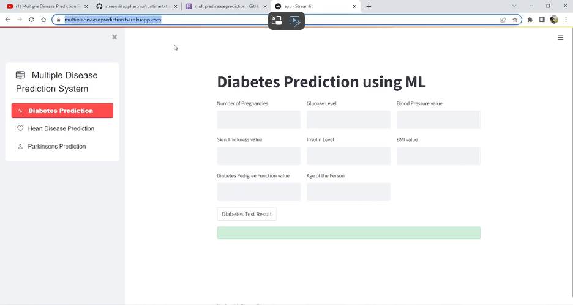
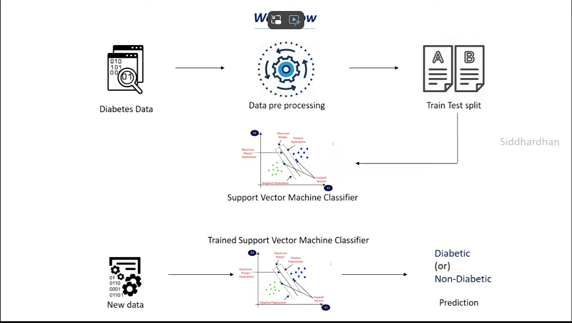
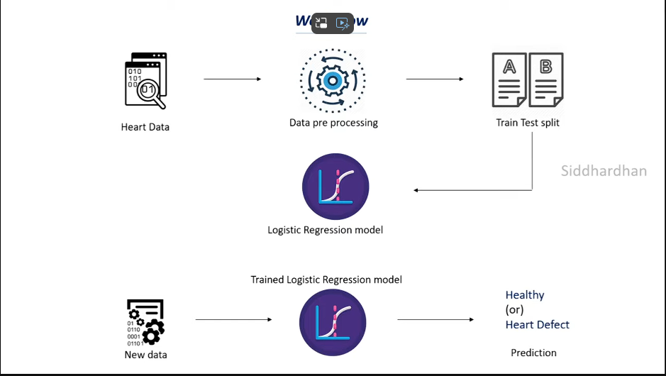
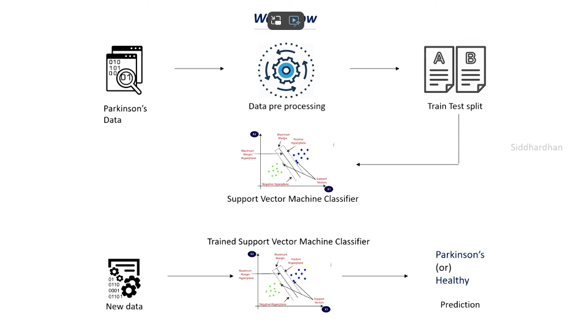

# Multiple-Disease-Detection-System-All_In_One-
🩺 **Heart Disease Detection System** 💓  

This AI tool predicts heart disease risk by analyzing key health metrics like age, cholesterol, and blood pressure. 🧠🔍 It provides quick, accurate results to help prevent serious conditions and support early treatment. Perfect for both healthcare pros and patients! 🌟

To deploy files directly from GitHub to a Streamlit app, follow these steps as outlined in your GitHub repo:

### Steps to Deploy Files from GitHub to Streamlit App

1. **Prepare Your GitHub Repository**
   - Ensure your repository contains all necessary files for your Streamlit app, including your `app.py` or main Python script, any required data files, and dependencies listed in a `requirements.txt` file.

2. **Create a Streamlit Account**
   - Sign up for a Streamlit Cloud account at [Streamlit Cloud](https://streamlit.io/cloud) if you haven't already.

3. **Connect Your GitHub Repository to Streamlit Cloud**
   - Log in to your Streamlit Cloud account.
   - Click on the "New App" button on the dashboard.
   - Choose "GitHub" as the deployment option.
   - Authorize Streamlit to access your GitHub account if prompted.

4. **Select Your Repository**
   - After authorization, you’ll be able to select the repository you want to deploy.
   - Choose the repository and branch that contains your Streamlit app.

5. **Configure Deployment Settings**
   - Specify the main file for your app (e.g., `app.py`).
   - Configure any additional settings if needed (e.g., environment variables).

6. **Deploy the App**
   - Click on "Deploy" to start the deployment process.
   - Streamlit Cloud will automatically build and deploy your app using the files from your GitHub repository.

7. **Monitor Deployment**
   - You can monitor the deployment progress on the Streamlit Cloud dashboard.
   - If there are any issues, check the logs provided to troubleshoot errors.

8. **Access Your Deployed App**
   - Once deployed, Streamlit Cloud will provide a URL where you can access your app.
   - Share this URL with others or embed it in your portfolio.

9. **Update Your App**
   - To update your app, push changes to your GitHub repository. Streamlit Cloud will automatically redeploy the updated version.

### Additional Tips

- **Dependencies**: Make sure your `requirements.txt` file lists all necessary Python packages.
- **Secrets**: Use Streamlit Cloud’s secrets management for sensitive information.
- **Documentation**: Refer to Streamlit’s [official documentation](https://docs.streamlit.io/) for detailed guidance on configuring and deploying Streamlit apps.

By following these steps, you can seamlessly deploy your Streamlit app from GitHub, ensuring a smooth and efficient development-to-deployment process.
==============================================================================================================================================================

Sure, let’s break down each of these disease detection systems:

### 1. Diabetes Detection System

**Objective:**
To diagnose or predict the likelihood of diabetes in a patient based on various health indicators.

**How It Works:**
- **Data Collection:** Collect patient data such as blood glucose levels, insulin levels, BMI, age, and family history of diabetes.
- **Feature Extraction:** Identify relevant features (e.g., fasting blood glucose, HbA1c levels) that are indicative of diabetes.
- **Machine Learning Models:** Use classification algorithms (e.g., logistic regression, decision trees, random forests, support vector machines) to train a model on historical patient data.
- **Prediction:** The trained model predicts the probability of a patient having diabetes based on their health indicators.
- **Evaluation:** Evaluate the model's performance using metrics like accuracy, precision, recall, and F1-score.

**Example Workflow:**
1. **Data Preprocessing:** Clean and normalize the data.
2. **Training:** Split data into training and test sets. Train the model on the training set.
3. **Testing:** Evaluate the model on the test set.
4. **Deployment:** Integrate the model into a healthcare system where it can assist in diagnosing diabetes.

### 2. Heart Disease Detection System

**Objective:**
To identify patients at risk of heart disease based on their clinical and lifestyle data.

**How It Works:**
- **Data Collection:** Gather data including blood pressure, cholesterol levels, heart rate, age, gender, smoking status, and family history.
- **Feature Engineering:** Create features that may indicate heart disease (e.g., cholesterol/HDL ratio, blood pressure variability).
- **Machine Learning Models:** Apply classification techniques (e.g., k-nearest neighbors, gradient boosting, neural networks) to classify patients as high-risk or low-risk for heart disease.
- **Prediction:** The model provides risk assessments based on input features.
- **Evaluation:** Assess model performance using metrics such as ROC-AUC (Receiver Operating Characteristic - Area Under Curve) and confusion matrix.

**Example Workflow:**
1. **Data Preprocessing:** Handle missing values and scale the data.
2. **Model Training:** Use historical patient data to train the model.
3. **Model Evaluation:** Test the model on unseen data to validate its performance.
4. **Implementation:** Implement the model in a clinical setting to aid in early detection and prevention.

### 3. Parkinson's Disease Detection System

**Objective:**
To detect Parkinson's disease in patients using symptoms and medical data, often focusing on motor symptoms.

**How It Works:**
- **Data Collection:** Collect data from various sources such as voice recordings, motion sensors, and clinical tests (e.g., Unified Parkinson’s Disease Rating Scale).
- **Feature Extraction:** Extract features related to motor control (e.g., tremor frequency, speech patterns) and non-motor symptoms.
- **Machine Learning Models:** Employ algorithms (e.g., support vector machines, random forests, deep learning) to identify patterns and classify the severity of Parkinson’s disease.
- **Prediction:** Predict the presence and stage of Parkinson’s disease based on collected features.
- **Evaluation:** Use performance metrics like sensitivity, specificity, and accuracy to evaluate the model.

**Example Workflow:**
1. **Data Acquisition:** Gather and preprocess data from various sources.
2. **Feature Selection:** Identify and select important features relevant to Parkinson’s symptoms.
3. **Model Development:** Train and validate the model using historical patient data.
4. **Deployment:** Use the model in diagnostic tools to assist healthcare professionals in identifying and managing Parkinson’s disease.

These systems utilize machine learning and data analytics to improve the early detection and management of diseases, aiding healthcare professionals in providing better patient care.

<h1>For, More Inquiries/ Data Available Here and Other IMP. Links</h1>

<h2>Baki Munna Bhai Tyaar Hn , Mujhko Tumsee _____</h2>
<ul>
   <li>Linkdin: https://www.linkedin.com/in/dhruv-dhayal-9568b7262/</li>
   <li>Github: https://github.com/BlockNotes-4515</li>
   <li>Instagram: https://www.instagram.com/dhayaldhruv271/?hl=en</li>
   <li>Google-Drive: https://drive.google.com/drive/folders/1KztFNuC4nkbccIRtoPkNsMycy3Jn9Wmy</li>
</ul>

